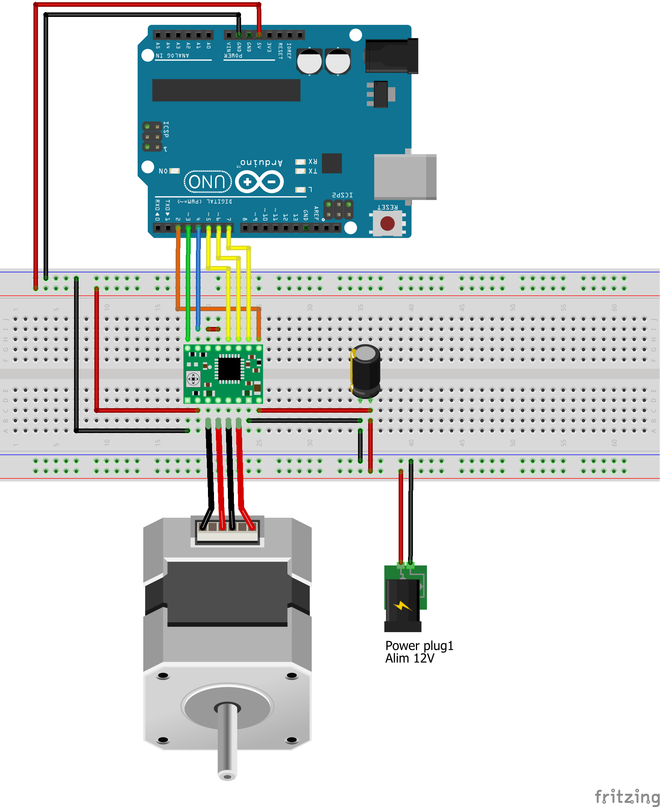
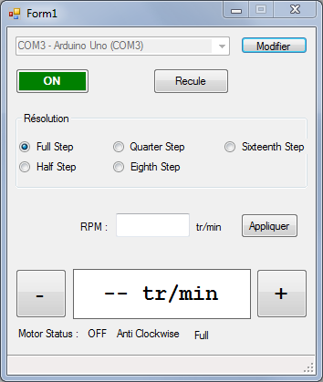

Pilotage d'un moteur pas pas avec le driver A4988
=================================================

Câblage
-------

Programme Arduino
-----------------

Ce programme répond à des commandes qui arrivent sur le port série configuré à 250000 bauds :

*  `STATUS` : Demande de l'état du moteur (ON/OF; sens de rotation; résolution; vitesse 
*  `M` : Mise en marche
*  `S` : Stop
*  `A` : Anti horaire
*  `R` : Horaire
*  `+` : Plus vite
*  `-` : Moins vite
*  `F` : Full step (plein pas)
*  `H` : Half step (demi pas)
*  `Q` : Quarter step (quart de pas)
*  `E` : Eighth step : (huitième de pas)
*  `X` : Sixteenth step : (seizième de pas)
*  `<nombre entier>` : Demi période du signal step : réglage de la vitesse

Programme Visual Studio C#
=========================

* Assure la détection et la connexion automatique à la carte Arduino
* Demmande le STATUS du drivers moteur (sa config actuelle)
* Actualisation synchrone de l'IHM  sur un timer toutes les 100 ms
* Commandes asynchrone du moteur (Marche/Arrêt, Résolution, Sens, Vitesse)

